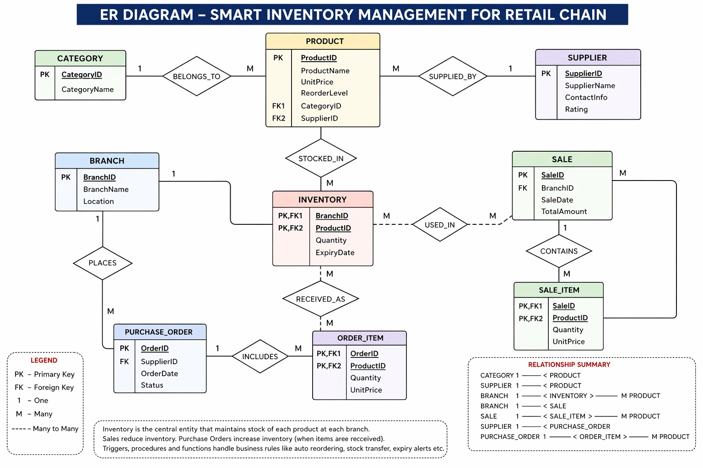

# Smart Inventory Management System

A full-stack DBMS project built using HTML, CSS, JavaScript, and SQL for managing inventory across multiple branches.

## Features
- Product management
- Inventory tracking
- Sales processing
- Stock transfer system
- Supplier management
- Purchase orders
- SQL query execution
- Analytics dashboard
- Low stock alerts
- Audit logging

## Technologies Used
- HTML5
- CSS3
- JavaScript
- SQL
- sql.js (WebAssembly SQLite)
- Vercel Deployment

## ER diagram

## Live Demo
https://smart-inventory-dbms.vercel.app/

## Database Concepts Implemented
- Normalization
- Transactions
- Triggers
- Stored Procedures
- Joins
- Indexing
- Constraints
- Audit Logs

## Project Structure
- `database.sql` → Database schema and queries
- `app.js` → Core application logic
- `styles.css` → UI styling
- `index.html` → Frontend structure

## Developed By
Yogesh Goyal
